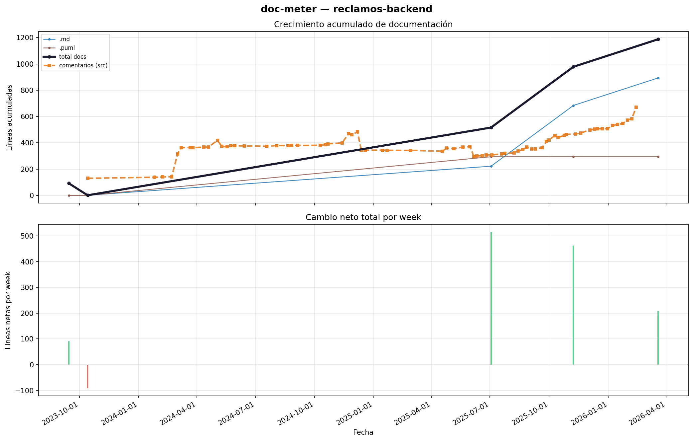

# doc-meter

Mide el crecimiento de documentación en un repositorio Git a lo largo del tiempo. Itera sobre los commits, filtra archivos de documentación por extensión, acumula líneas netas y genera una gráfica de crecimiento — incluyendo comentarios en código fuente como indicador de documentación técnica.

## Instalación

```bash
pip install -r requirements.txt
```

Requisitos: Python 3.10+ y Git en el PATH.

## Uso

```bash
# Análisis básico — agrupa por semana, gráfica interactiva
python doc_meter.py /ruta/al/repo

# Guardar gráfica como imagen
python doc_meter.py /ruta/al/repo --output salida.png

# Agrupar por mes, solo branch main
python doc_meter.py /ruta/al/repo --interval month --branch main

# Solo resumen en consola (sin gráfica ni análisis de comentarios)
python doc_meter.py /ruta/al/repo --no-plot --no-comments

# Exportar datos a CSV
python doc_meter.py /ruta/al/repo --output-csv datos.csv

# Gráfica y CSV al mismo tiempo
python doc_meter.py /ruta/al/repo --output salida.png --output-csv datos.csv
```

## Opciones

| Argumento | Descripción | Default |
|---|---|---|
| `repo` | Ruta al repositorio Git | (requerido) |
| `--interval` | Agrupación temporal: `day`, `week`, `month` | `week` |
| `--branch` | Branch a analizar | branch actual |
| `--output`, `-o` | Ruta para guardar la gráfica | (interactiva) |
| `--output-csv` | Ruta para exportar los datos como CSV | — |
| `--extensions` | Extensiones de documentación | ver lista abajo |
| `--no-plot` | Solo resumen en consola, sin gráfica | — |
| `--no-comments` | Omitir análisis de comentarios en código fuente | — |

**Extensiones de documentación detectadas por defecto:**
`.adoc` `.asc` `.asciidoc` `.ipynb` `.markdown` `.md` `.mdx` `.org` `.plantuml` `.puml` `.qmd` `.rst` `.tex` `.txt` `.wiki`

**Lenguajes analizados para comentarios:**
Python, JavaScript/TypeScript, C#, Java, C/C++, Go, Rust, Kotlin, Swift, Scala, Dart, Ruby, Shell, SQL, Lua, HTML, CSS/SCSS y más.

## Salida

Consola: commits procesados, período, líneas añadidas/eliminadas/netas y total acumulado de comentarios en código.

Gráfica de dos paneles:

- **Superior:** crecimiento acumulado, una línea por extensión de documentación + línea total (negra gruesa) + línea de comentarios en código fuente (naranja punteada).
- **Inferior:** cambio neto por período (verde = crecimiento, rojo = reducción).

CSV (con `--output-csv`): una fila por período con las columnas `date`, `total_docs`, `net_docs`, una columna por cada extensión detectada y `comments_src` si se analizaron comentarios.

## Ejemplo


